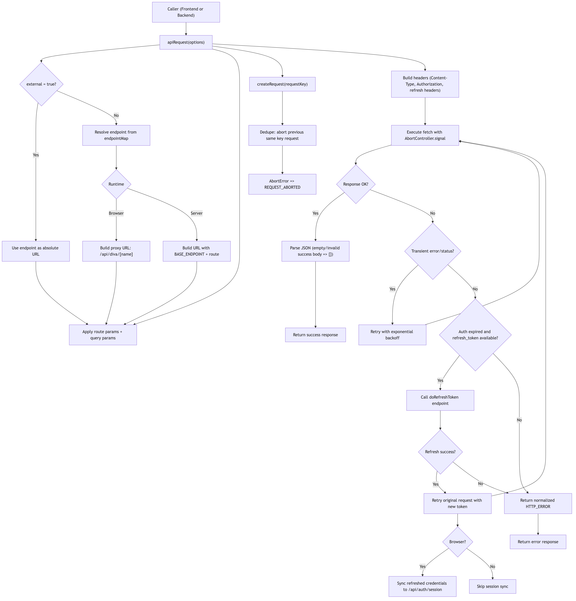

# diva-api

`diva-api` is a small request client for internal API routes and external APIs with:
- endpoint alias mapping
- route params + query support
- frontend proxying (`/api/diva/[name]`) to hide private backend host
- request dedupe + abort
- retry with exponential backoff
- auth refresh retry flow
- normalized response/error shape

## Flow Diagram



## Quick Start

```ts
import { apiRequest } from '$lib/diva-api/apiClient'

const response = await apiRequest<{ id: number; username: string }[]>({
  endpoint: 'getUsers',
  requiresAuth: false
})

if (!response.success) {
  console.error(response.error.code, response.error.message)
  return
}

console.log(response.data)
```

## Response Shape

Success:
```ts
{
  success: true,
  data: T,
  meta?: {
    authCredentials?: {
      access_token?: string
      refresh_token?: string
      expires_at?: number | string
    }
  }
}
```

Failure:
```ts
{
  success: false,
  error: {
    code: string
    message: string
    details?: unknown
  }
}
```

## apiRequest Options

```ts
type RequestOptions = {
  endpoint: string
  baseEndpoint?: string
  method?: 'GET' | 'POST' | 'PUT' | 'DELETE' | 'PATCH'
  params?: Record<string, string | number>
  query?: Record<string, string | number | boolean | null | undefined | Array<string | number | boolean>>
  body?: unknown
  headers?: Record<string, string>
  credentials?: RequestCredentials
  authCredentials?: {
    access_token?: string
    refresh_token?: string
    expires_at?: number | string
  }
  external?: boolean
  requestKey?: string
  requiresAuth?: boolean
  retryCount?: number
  retryDelayMs?: number
  retryBackoffMultiplier?: number
  fetchFn?: typeof fetch
}
```

### Key Options
- `endpoint`: alias from `endpointMap` (internal) or absolute URL (external).
- `external: true`: bypasses alias/proxy and calls URL directly.
- `params`: replaces `:paramName` in mapped route.
- `query`: appends query string (supports arrays as repeated keys).
- `requestKey`: dedupe key. Same key aborts previous in-flight request.
- `requiresAuth`: include auth header logic.
- `authCredentials`: request-scoped token data (recommended for SSR).
- `retryCount`: max retries for transient failure.
- `retryDelayMs`: base backoff delay in ms.
- `retryBackoffMultiplier`: exponential multiplier (default `2`).

## Internal Endpoint Mapping

`src/lib/diva-api/endpointMap.ts`:

```ts
export const endpointMap = [
  {
    name: 'getUsers',
    route: '/api/users',
    method: 'GET',
    params: []
  }
]
```

Example with route params:

```ts
await apiRequest({
  endpoint: 'GET__POLICIES__PRODUCT_LIMIT_SUMMARY',
  params: { policyId: 10, sequence: 2 },
  requiresAuth: false
})
```

## Internal vs External Behavior

### Internal call (default)
- In **browser**: calls `/api/diva/[name]` (proxy)
- In **server**: calls `${BASE_ENDPOINT}${route}` directly

### External call (`external: true`)
- Uses the provided absolute URL directly in both browser/server

```ts
await apiRequest({
  endpoint: 'https://api.github.com/users/fujianto/repos',
  external: true,
  method: 'GET',
  requiresAuth: false
})
```

## Auth + Refresh Behavior

If request fails with token-expired conditions and `authCredentials.refresh_token` exists:
1. Calls mapped `doRefreshToken`
2. Retries original request with refreshed access token
3. Returns refreshed tokens in `result.meta.authCredentials`
4. In browser, syncs refreshed tokens to `/api/auth/session`

## Retry Behavior

Transient retries apply to:
- statuses: `408, 425, 429, 500, 502, 503, 504`
- network/timeouts (non-abort)

Backoff formula:
```txt
delay = retryDelayMs * retryBackoffMultiplier^(attempt-1)
```

Defaults:
- `GET`: `retryCount = 2`
- non-GET: `retryCount = 0`

## Request Dedupe and Abort

`requestKey` dedupes in-flight calls:
- New request with same key aborts previous one.
- Aborted request returns:
```json
{
  "success": false,
  "error": {
    "code": "REQUEST_ABORTED",
    "message": "Request was cancelled"
  }
}
```

## SSR-Safe Token Usage

On server runtime, `apiRequest` does **not** read global token store fallback.
Use request-scoped `authCredentials`:

```ts
await apiRequest({
  endpoint: 'getUsers',
  requiresAuth: true,
  authCredentials: {
    access_token: event.locals.user?.access_token,
    refresh_token: event.locals.user?.refresh_token,
    expires_at: event.locals.user?.expires_at
  },
  fetchFn: event.fetch
})
```

## Advanced Examples

### Frontend call with credentials
```ts
import { apiRequest } from '$lib/diva-api/apiClient'

const res = await apiRequest({
  endpoint: 'getUsers',
  method: 'GET',
  credentials: 'include',
  requiresAuth: false,
  authCredentials: {
    access_token: authState?.access_token,
    refresh_token: authState?.refresh_token,
    expires_at: authState?.expires_at
  }
})
```

### Backend (SvelteKit server) call with request-scoped credentials
```ts
// +page.server.ts or +layout.server.ts
import { apiRequest } from '$lib/diva-api/apiClient'
import { env } from '$env/dynamic/private'

const res = await apiRequest({
  endpoint: 'getUsers',
  method: 'GET',
  baseEndpoint: env.BASE_ENDPOINT,
  credentials: 'include',
  requiresAuth: true,
  fetchFn: event.fetch,
  authCredentials: {
    access_token: event.locals.user?.access_token,
    refresh_token: event.locals.user?.refresh_token,
    expires_at: event.locals.user?.expires_at
  }
})
```

### POST with body
```ts
await apiRequest({
  endpoint: 'doLogin',
  method: 'POST',
  requiresAuth: false,
  body: { login: 'jane', password: 'secret123' }
})
```

### Query string
```ts
await apiRequest({
  endpoint: 'getUsers',
  query: { page: 1, limit: 20, role: ['admin', 'cashier'] },
  requiresAuth: false
})
```

### Custom retry strategy
```ts
await apiRequest({
  endpoint: 'getUsers',
  requiresAuth: false,
  retryCount: 3,
  retryDelayMs: 200,
  retryBackoffMultiplier: 2
})
```

### Manual request dedupe key
```ts
await apiRequest({
  endpoint: 'getUsers',
  requestKey: 'dashboard-users',
  requiresAuth: false
})
```

## Notes
- For internal server-side calls, `BASE_ENDPOINT` must be configured.
- Browser internal calls are proxied to avoid exposing private backend host.
