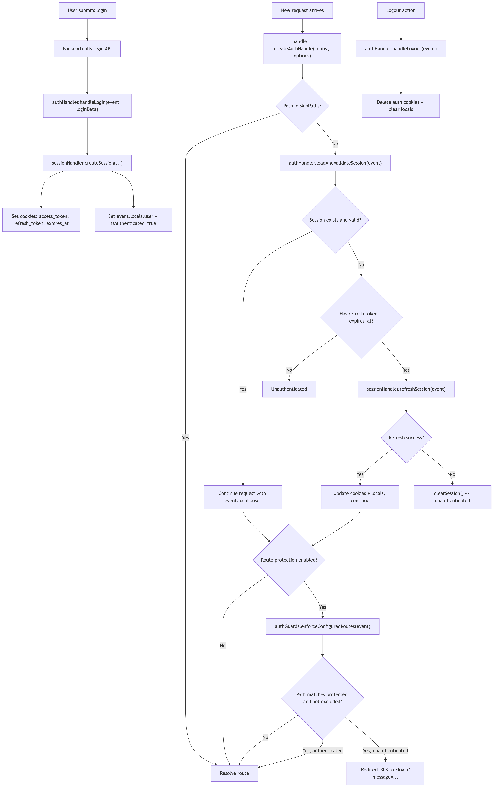
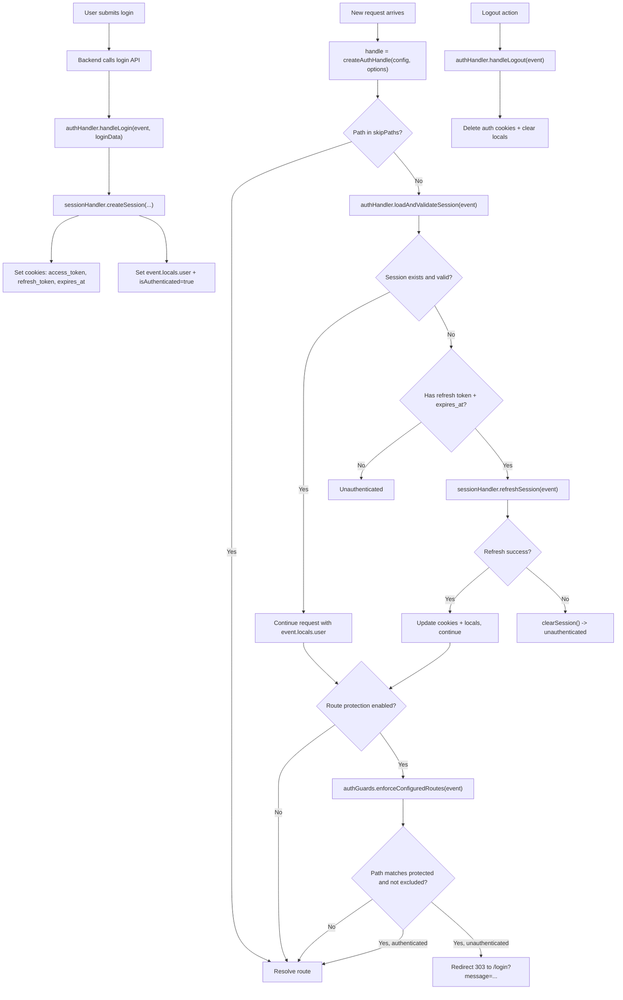

# diva-auth

`diva-auth` provides session handling, cookie management, refresh flow, and route guards for SvelteKit.

## Flow Diagram



## Features
- login/logout helpers
- cookie-based session persistence
- access token refresh support
- route guard helpers (`requireAuth`, role checks)
- optional centralized protected-route enforcement (disabled by default)

## Exports

```ts
import {
  authHandler,
  sessionHandler,
  cookieManager,
  authGuards,
  createAuthHandle,
  mergeAuthConfig,
  AuthHandler,
  SessionHandler,
  CookieManager,
  AuthGuards,
  DEFAULT_AUTH_CONFIG,
  type DivaAuthConfig,
  type LoginResponseData,
  type LocalsUser
} from '$lib/diva-auth'
```

## Core Types

### `LoginResponseData`
```ts
{
  success: boolean
  access_token: string
  refresh_token: string
  expires_at: number
  user: {
    id: number
    username: string
    email: string
    display_name: string
    roles: string[]
  }
}
```

### `DivaAuthConfig`
```ts
{
  cookieNames: {
    accessToken: string
    refreshToken: string
    expiresAt: string
  }
  cookieOptions: {
    httpOnly: boolean
    secure: boolean
    sameSite: 'strict' | 'lax' | 'none'
    path: string
  }
  refreshEndpoint: string
  redirectUrls: {
    login: string
    dashboard: string
  }
  routeProtection: {
    enabled: boolean
    protectedRoutes: string[]
    excludedRoutes: string[]
  }
}
```

## Default Config

```ts
DEFAULT_AUTH_CONFIG = {
  cookieNames: {
    accessToken: 'access_token',
    refreshToken: 'refresh_token',
    expiresAt: 'expires_at'
  },
  cookieOptions: {
    httpOnly: true,
    secure: process.env.NODE_ENV === 'production',
    sameSite: 'lax',
    path: '/'
  },
  refreshEndpoint: '/api/auth/refresh',
  redirectUrls: {
    login: '/login',
    dashboard: '/dashboard'
  },
  routeProtection: {
    enabled: false,
    protectedRoutes: [],
    excludedRoutes: []
  }
}
```

## Recommended Hook Setup

```ts
// src/hooks.server.ts
import { createAuthHandle } from '$lib/diva-auth'

export const handle = createAuthHandle({
  routeProtection: {
    enabled: true,
    protectedRoutes: ['/dashboard/*', '/admin/*'],
    excludedRoutes: ['/dashboard/public']
  }
})
```

Custom skip paths:
```ts
export const handle = createAuthHandle(
  { routeProtection: { enabled: true, protectedRoutes: ['/dashboard/*'], excludedRoutes: [] } },
  { skipPaths: ['/api/auth/session', '/api/health'] }
)
```

## Authentication Flow Diagram



## AuthHandler API

### `handleLogin(event, loginData)`
Creates session cookies + populates `event.locals.user`.

### `handleLogout(event)`
Clears auth cookies and locals.

### `loadAndValidateSession(event)`
Loads cookie session, refreshes if needed, writes locals.
Returns `boolean` valid state.

### `validateSession(event)`
Validates an already-loaded session and refreshes if expired.

### `isAuthenticated(event)`
Returns `event.locals.isAuthenticated ?? false`.

## Config Utilities

### `mergeAuthConfig(partialConfig)`
Deep-merges nested auth config so partial overrides do not drop defaults.

```ts
const config = mergeAuthConfig({
  redirectUrls: { login: '/signin' },
  routeProtection: { enabled: true }
})
```

## SessionHandler API

### `createSession(eventOrCookies, loginData, locals?)`
Sets cookies and local user from login payload.

### `loadSession(event)`
Returns partial session from cookies or `null`.

### `refreshSession(event)`
Calls refresh endpoint and updates cookies.

### `isSessionValid(event)` / `isSessionExpired(event)`
Expiry checks.

### `clearSession(event)`
Deletes auth cookies and resets locals.

### `getSessionExpiry(event)`
Returns remaining seconds until expiry.

## CookieManager API

### `setAuthCookies(cookies, accessToken, refreshToken, expiresAt)`
Writes all auth cookies.

### `getAuthCookies(cookies)`
Returns:
```ts
{ accessToken?: string; refreshToken?: string; expiresAt?: string }
```

### `deleteAuthCookies(cookies)`
Deletes all auth cookies.

### `hasAuthCookies(cookies)`
Boolean check for complete auth cookies.

### `isTokenExpired(expiresAt)`
Expiry utility for string/number timestamp.

## AuthGuards API

### `requireAuth(event)`
Validates session, redirects to login when unauthenticated.
Returns `{ user }` when valid.

### `isAuthenticated(event)`
Boolean auth check.

### `hasRole(event, roleOrRoles)`
Checks role membership.

### `requireRole(event, roleOrRoles)`
Throws `403` if role check fails.

### `redirectToLogin(event, message?)`
Redirect helper with optional message query.

### `enforceConfiguredRoutes(event)`
Applies route protection from `config.routeProtection`:
- `enabled: false` => no-op
- checks `excludedRoutes` first
- matches exact patterns and wildcard prefix (`/admin/*`)
- calls `requireAuth` when matched

## Hook Factory API

### `createAuthHandle(config?, options?)`
Creates a ready-to-use SvelteKit `handle` function that:
1. initializes `event.locals`
2. loads and validates session
3. enforces configured route protection

Options:
```ts
{
  skipPaths?: string[] // default: ['/api/auth/session']
}
```

## Usage Patterns

### Protect one route manually
```ts
// +page.server.ts
import { authGuards } from '$lib/diva-auth'

export async function load(event) {
  return authGuards.requireAuth(event)
}
```

### Protect all selected routes globally
Use `AuthGuards.enforceConfiguredRoutes(event)` once in hook (see setup section).

### Role-restricted page
```ts
import { authGuards } from '$lib/diva-auth'

export async function load(event) {
  await authGuards.requireAuth(event)
  authGuards.requireRole(event, ['admin', 'super-admin'])
  return { user: event.locals.user }
}
```

### Logout action
```ts
import { authHandler } from '$lib/diva-auth'
import { redirect } from '@sveltejs/kit'

export const actions = {
  logout: async (event) => {
    authHandler.handleLogout(event)
    redirect(303, '/login')
  }
}
```

## Notes
- `routeProtection` is opt-in and disabled by default.
- `refreshEndpoint` should point to an endpoint that returns refreshed tokens.
- Cookie names are configurable for integration with existing systems.
- config overrides are deep-merged via `mergeAuthConfig`.
